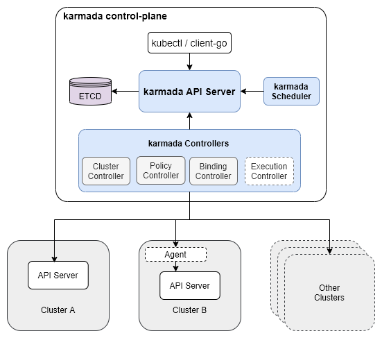
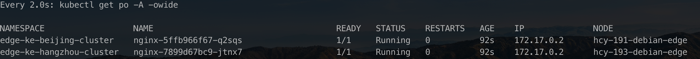

# Kamarda 多集群管理 在 KubeEdge 中的应用


## 什么是Karmada

Karmada (Kubernetes Armada)，是华为开源的云原生多云容器编排平台，目标是让开发者像使用单个k8s集群一样使用多k8s云。它的第一个release（v0.1.0）出现在2020年12月，而正式发布则是在2021年4月25日，在深圳召开的华为开发者大会（HDC.Cloud）2021上。

官方网站：https://karmada.io/

代码地址：https://github.com/karmada-io/karmada

使用karmada管理的多云环境包含两类集群：

1. host集群：即由karmada控制面构成的集群，接受用户提交的应用部署需求，将之同步到member集群，并从member集群同步应用后续的运行状况。
2. member集群：由一个或多个k8s集群构成，负责运行用户提交的应用。




### 关键概念


#### Cluster

Cluster代表资源部署的目标集群，一个集群对应一个k8s的控制面。一个cluster有push和pull两种模式。


#### Resource template: 

Karmada使用Kubernetes Native API定义作为联邦资源模板，以方便与Kubernetes上已经采用的现有工具集成，例如：

``` yaml
apiVersion: apps/v1
kind: Deployment
metadata:
  name: nginx
  labels:
    app: nginx
spec:
  replicas: 1
  selector:
    matchLabels:
      app: nginx
  template:
    metadata:
      labels:
        app: nginx
    spec:
      containers:
      - image: nginx
        name: nginx
```


#### PropagationPolicy

Karmada提供了独立的传播策略API来定义多集群调度和传播需求，例如：

``` yaml
apiVersion: policy.karmada.io/v1alpha1
kind: PropagationPolicy
metadata:
  name: nginx-propagation
spec:
  resourceSelectors:
    - apiVersion: apps/v1
      kind: Deployment
      name: nginx
  placement:
    clusterAffinity:
      clusterNames:
        - cluster1
        - cluster2
```


#### ResourceBinding

ResourceBinding表示一个kubernetes资源与一个传播策略的绑定。在创建PropagationPolicy以后生成。如下：

```yaml
apiVersion: work.karmada.io/v1alpha1
kind: ResourceBinding
metadata:
  annotations:
    policy.karmada.io/applied-placement: '{"clusterAffinity":{"clusterNames":["ke-beijing-cluster","ke-hangzhou-cluster"]}}'
  creationTimestamp: "2021-09-14T07:20:58Z"
  generation: 2
  labels:
    propagationpolicy.karmada.io/name: nginx-propagation
    propagationpolicy.karmada.io/namespace: edge
  name: nginx-deployment
  namespace: edge
  ownerReferences:
  - apiVersion: apps/v1
    blockOwnerDeletion: true
    controller: true
    kind: Deployment
    name: nginx
    uid: 82101e0a-b5f7-48b6-833a-7985a8325416
  resourceVersion: "481106"
  selfLink: /apis/work.karmada.io/v1alpha1/namespaces/edge/resourcebindings/nginx-deployment
  uid: b3bba8ed-d923-444f-8aa5-a1cb3941e305
spec:
  clusters:
  - name: cluster1
  - name: cluster2
  replicaRequirements:
    resourceRequest:
      cpu: "0"
      memory: "0"
  replicas: 1
  resource:
    apiVersion: apps/v1
    kind: Deployment
    name: nginx
    namespace: edge
    resourceVersion: "424146"
```


#### OverridePolicy

Karmada提供了独立的Override Policy API，用于专门定制与集群相关的配置自动化，例如：

```yaml
apiVersion: policy.karmada.io/v1alpha1
kind: OverridePolicy
metadata:
  name: example-override
  namespace: default
spec:
  resourceSelectors:
    - apiVersion: apps/v1
      kind: Deployment
  targetCluster:
    clusterNames:
      - cluster1
  overriders:
    imageOverrider:
      - component: Tag
        operator: replace
        value: 1.21.3
```

上面定义的OverridePolicy更改了部署在cluster1上的nginx的镜像。


#### Work

Work 定义了一个要在成员集群上部署的资源列表。是在Karmada层面在最终生成出来的资源对象， 再把这个资源对象push到对应的cluster进行部署。

```yaml
apiVersion: work.karmada.io/v1alpha1
kind: Work
metadata:
  creationTimestamp: "2021-09-14T07:20:58Z"
  finalizers:
  - karmada.io/execution-controller
  generation: 1
  labels:
    resourcebinding.karmada.io/name: nginx-deployment
    resourcebinding.karmada.io/namespace: edge
  name: nginx-867c85cb75
  namespace: karmada-es-ke-beijing-cluster
  resourceVersion: "482071"
  selfLink: /apis/work.karmada.io/v1alpha1/namespaces/karmada-es-ke-beijing-cluster/works/nginx-867c85cb75
  uid: 3da57b67-1c4e-4da4-bf6c-6b0e77461a80
spec:
  workload:
    manifests:
    - apiVersion: apps/v1
      kind: Deployment
      metadata:
        annotations:
          kubectl.kubernetes.io/last-applied-configuration: |
            {"apiVersion":"apps/v1","kind":"Deployment","metadata":{"annotations":{},"labels":{"app":"nginx"},"name":"nginx","namespace":"edge"},"spec":{"replicas":1,"selector":{"matchLabels":{"app":"nginx"}},"template":{"metadata":{"labels":{"app":"nginx"}},"spec":{"containers":[{"image":"nginx","name":"nginx"}]}}}}
        labels:
          app: nginx
          propagationpolicy.karmada.io/name: nginx-propagation
          propagationpolicy.karmada.io/namespace: edge
          resourcebinding.karmada.io/name: nginx-deployment
          resourcebinding.karmada.io/namespace: edge
          work.karmada.io/name: nginx-867c85cb75
          work.karmada.io/namespace: karmada-es-ke-beijing-cluster
        name: nginx
        namespace: edge
      spec:
        progressDeadlineSeconds: 600
        replicas: 1
        revisionHistoryLimit: 10
        selector:
          matchLabels:
            app: nginx
        strategy:
          rollingUpdate:
            maxSurge: 25%
            maxUnavailable: 25%
          type: RollingUpdate
        template:
          metadata:
            creationTimestamp: null
            labels:
              app: nginx
          spec:
            containers:
            - image: nginx
              imagePullPolicy: Always
              name: nginx
              resources: {}
              terminationMessagePath: /dev/termination-log
              terminationMessagePolicy: File
            dnsPolicy: ClusterFirst
            restartPolicy: Always
            schedulerName: default-scheduler
            securityContext: {}
            terminationGracePeriodSeconds: 30
```


### 流程


1. resource detector：监听propagation policy和k8s原生API资源对象（包括CRD资源）的变化，实现两者的绑定。绑定的结果是产生ResourceBinding

2. propagation policy controller：仅有少量检测逻辑：检测propagation policy依赖的override policy是否已经创建，见前面nginx例子中的propagation policy对象的dependentOverrides属性。但无论依赖的override policy是否已经创建，propagation policy controller都不会有后续的绑定propagation policy和k8s原生API资源对象（包括CRD资源）的动作。因此可以说propagation policy controller无实际作用。真正的绑定逻辑存在resource detector的Reconcile方法中。因此我们后续不再讨论propagation policy controller。
3. resource binding controller：把resource binding转换为work
4. execution controller：把work中包含的k8s原生API资源（或CRD资源）同步到push模式的member集群中（pull模式的member集群会用agent拉取work到本地）KubeEdge为什么需要Karmada


### 为什么KudeEdge需要Karmada

#### 痛点

KubeEdge在部署架构上是一个平铺的模式，所有的边缘节点都接入一个ApiServer，但是在某些场景又需要以不同的区域划分，在每个区域下分别部署同一个应用。比如中国银行部署了一套KubeEdge，这时候需要部署一个应用A到各个不同的分行，这时候需要对中国银行的边缘节点进行分组，比如北京分行打上label `region: beijing` 杭州分行打上 label `regio: hangzhou` 类似的分行如果有10个，那我们在部署应应用A的时候就不得不写10个`Deployment`通过`nodeSelector`来区分，而这10个`Deployment`可能也就是`nodeSelector`不一样而已，这不免让人崩溃。

#### 需求

有没有一种方法我只需要写一个应用A的Deployment，再写一个应用A应该传播到哪些分行的策略就可以把应用A部署到分行。

#### 方案

答案肯定是有的，利用Karmada就可以做到，但是原生的Karmada的设定一个cluster就应该对应一个apiserver，然后把模板资源部署到各个cluster里面，但是我们的kubeedge就只有一个apiserver，在Karmada看来就是一个cluster，模板资源也只会下发一份到kubeedge，这就需要把kubeedge划分出多个虚拟cluster，每个分行对应一个cluster，那么模板资源就会下发到各个cluster进行部署。如下图：


##### 要点1

Agent：在cluster的pull模式下，需要在cluster里部署一个agent，主要负责去 list-watch work资源然后把拿到的workload部署在集群，另外还负责上报cluster的状态和work的状态。但是Karmada原生的agent只能管理一个集群，需要改造成一个agent可以管理多个虚拟集群。

##### 要点2

原生的Karmada部署资源的时候，就是在对应cluster部署一个同namespace，同name的资源，但是现在在KubeEdge中实际上只有一个cluster，所以需要以namespace来隔离部署到虚拟cluster中的资源。

##### 要点3

在需要以namesapce来隔离部署到KubeEdge虚拟cluster的资源的情况下，原来的资源创建、更新和删除逻辑都需要更改。

1. Namespace资源：在Karmada创建一个namespace后，在KubeEdge里面对应的应该创建两个对应的带cluster名称后缀的namespace，例如创建一个edge的namespace后，在KubeEdge创建一个edge-ke-beijing-cluster，一个edge-ke-hangzhou-cluster的namespace。如图所示：

   

   更新namespace时，也需要对相应的虚拟cluster里面的namespace进行更新；删除namespace的时候也应该删除各个虚拟cluster对应的namespace。

2. Deployment资源：在Karmada创建一个deployment后，在KubeEdge里面应该在对应的虚拟cluster namespace下创建deployment，如图所示：

   

   1. 在agent监控到对应资源的work是，拿出workload修改namespace，使之部署在KubeEdge对应的namespace中。
   2. 在agent监控到对应资源的work是，拿出workload修改nodeSelector，使之调度到所属虚拟cluster的边缘节点上。

3. 其他资源：以service为例，在Karmada创建一个service后，在KubeEdge里面应该在对应的虚拟cluster namespace下创建service，如图所示：

   

   1. 在agent监控到对应资源的work是，拿出workload修改namespace，使之部署在KubeEdge对应的namespace中。

#### 效果

在agent启动以后在Karmada创建了两个cluster，这两个cluster是以node的label为`location: beijing`和`location: hangzhou`来划分，如下图：


在Karmada创建以下的资源：

```yaml
apiVersion: v1
kind: Namespace
metadata:
  name: edge

---
apiVersion: policy.karmada.io/v1alpha1
kind: PropagationPolicy
metadata:
  name: nginx-propagation
  namespace: edge
spec:
  resourceSelectors:
    - apiVersion: apps/v1
      kind: Deployment
      name: nginx
      namespace: edge
    - apiVersion: v1
      kind: Service
      name: nginx-service
      namespace: edge
  placement:
    clusterAffinity:
      clusterNames:
        - ke-beijing-cluster
        - ke-hangzhou-cluster

---
apiVersion: apps/v1
kind: Deployment
metadata:
  name: nginx
  namespace: edge
  labels:
    app: nginx
spec:
  replicas: 1
  selector:
    matchLabels:
      app: nginx
  template:
    metadata:
      labels:
        app: nginx
    spec:
      containers:
      - image: nginx
        name: nginx

---
apiVersion: v1
kind: Service
metadata:
  name: nginx-service
  namespace: edge
spec:
  selector:
    app: nginx
  ports:
    - protocol: TCP
      port: 80
      targetPort: 80
```

在KubeEdge中的namespace，如下图：


在KubeEdge中的deployment，如下图：


deployment详情部分截图：


在KubeEdge中的pod，如下图：



在kubeedge中的servcie，如下图：


service详情：


